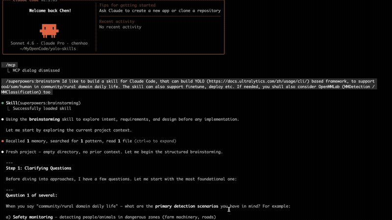

# yolo-skills

Claude Code skill suite for YOLO-based computer vision pipelines targeting rural/community daily life scenarios in China.

## Demo

<!-- GitHub renders <video> natively. For other viewers, the GIF preview below plays automatically. -->
<video src="demo/demo-auto-build-algo-by-CC.mp4" controls width="100%">
  
</video>

> Full demo (4.6 min): Claude Code building a complete 牛马占道 (livestock-straying) detection algorithm from scratch — brainstorm → design → scaffold → smoke test with circle annotations.

## What's in this repo

```
yolo-skills/
├── demo/                       # Demo video + preview GIF
├── skills/yolo-rural/          # Claude Code skills (install to ~/.claude/skills/)
│   ├── SKILL.md                # Root router
│   ├── scaffold/SKILL.md       # Project scaffolding
│   ├── train/SKILL.md          # Training & finetuning
│   ├── deploy/SKILL.md         # Edge & cloud deployment
│   ├── active-learning/SKILL.md # Collect → annotate → retrain loop
│   └── diagnose/SKILL.md       # Performance diagnosis
├── livestock-stray-project/    # Example: 牛马占道 detection project
└── docs/plans/                 # Design docs & implementation plans
```

## Scenarios

| Scenario | Chinese | Model |
|----------|---------|-------|
| Livestock straying into public areas | 牛马占道 | YOLOv8m |
| Public disorder / fighting | 打架斗殴 | YOLOv8-pose |
| Fire safety / open flame | 明火识别 | YOLOv8n-seg |
| Illegal fishing | 垂钓检测 | YOLOv8s |
| Livestock disease recognition | 病害识别 | MMPretrain / YOLOv8-cls |

## Install Skills

```bash
cp -r skills/yolo-rural ~/.claude/skills/
```

## Usage in Claude Code

Just describe what you want in natural language:

```
"set up a fire detection project"       → yolo-rural:scaffold
"finetune on my new cattle images"      → yolo-rural:train
"deploy to Jetson Orin"                 → yolo-rural:deploy
"add new data and retrain"              → yolo-rural:active-learning
"why is my model failing"               → yolo-rural:diagnose
```

## Example Project: 牛马占道

`livestock-stray-project/` is a fully scaffolded example:

```bash
cd livestock-stray-project

# Annotate your images
./scripts/annotate.sh          # Label Studio on :8080

# Train
./scripts/train.sh

# Smoke test with circle annotation
python scripts/smoke_test.py

# Deploy as cloud API
docker build -t livestock-stray -f deployment/Dockerfile .
docker run -d -p 8000:8000 livestock-stray
```

## Stack

- [Ultralytics YOLO](https://docs.ultralytics.com/) — detection, segmentation, pose, classification
- [OpenMMLab MMPretrain](https://github.com/open-mmlab/mmpretrain) — fine-grained disease classification
- [Segment Anything (SAM)](https://github.com/facebookresearch/segment-anything) — annotation assistance
- [Label Studio](https://labelstud.io/) — data labeling
- FastAPI + Docker — cloud inference API
